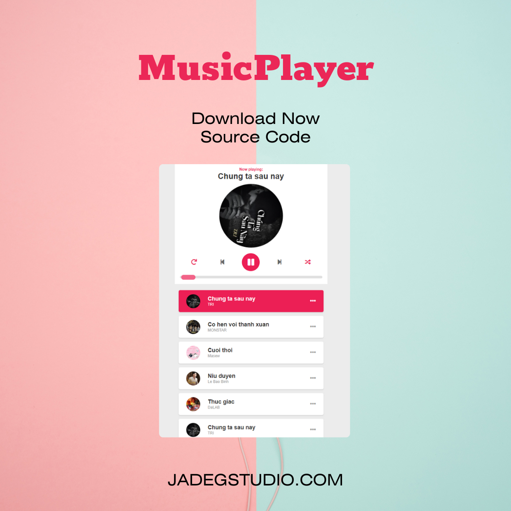

# MusicPlayerUI

## Author

* datz0512 - https://github.com/datz0512
* Demo page: https://jadeg-studios.github.io/MusicPlayerUI/

## Description

* Building a music player app requires a great deal of attention to detail. It needs to have a fast and smooth user interface with clean code structure. To achieve this, developers must use HTML, CSS, and JavaScript to create the source code clone that will be used for the UI design. By doing so, they can ensure that the app allows users to hear music quickly and easily without any issues. Additionally, it will also create an aesthetically pleasing experience for users with its attractive design.


## Demo image



## License Information

* This software is licensed under MIT License.
* [Read More](https://choosealicense.com/licenses/mit/) on the license.


```
MIT License

Copyright (c) 2023 JadeG Studio

Permission is hereby granted, free of charge, to any person obtaining a copy
of this software and associated documentation files (the "Software"), to deal
in the Software without restriction, including without limitation the rights
to use, copy, modify, merge, publish, distribute, sublicense, and/or sell
copies of the Software, and to permit persons to whom the Software is
furnished to do so, subject to the following conditions:

The above copyright notice and this permission notice shall be included in all
copies or substantial portions of the Software.

THE SOFTWARE IS PROVIDED "AS IS", WITHOUT WARRANTY OF ANY KIND, EXPRESS OR
IMPLIED, INCLUDING BUT NOT LIMITED TO THE WARRANTIES OF MERCHANTABILITY,
FITNESS FOR A PARTICULAR PURPOSE AND NONINFRINGEMENT. IN NO EVENT SHALL THE
AUTHORS OR COPYRIGHT HOLDERS BE LIABLE FOR ANY CLAIM, DAMAGES OR OTHER
LIABILITY, WHETHER IN AN ACTION OF CONTRACT, TORT OR OTHERWISE, ARISING FROM,
OUT OF OR IN CONNECTION WITH THE SOFTWARE OR THE USE OR OTHER DEALINGS IN THE
SOFTWARE.
```
